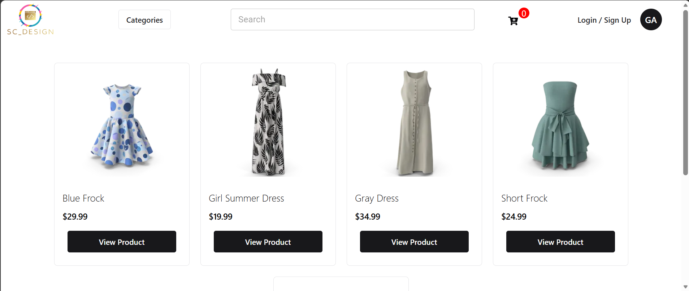
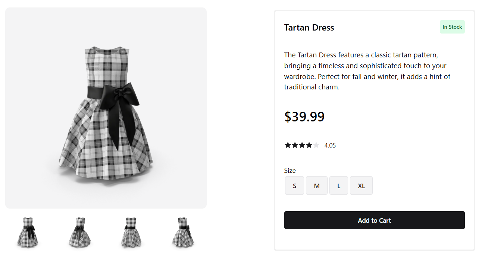
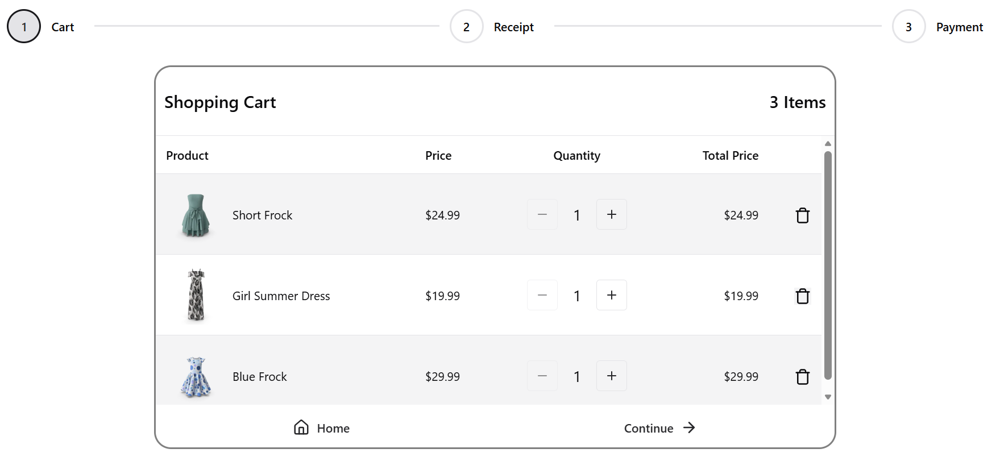
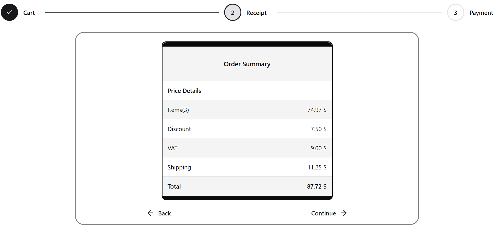
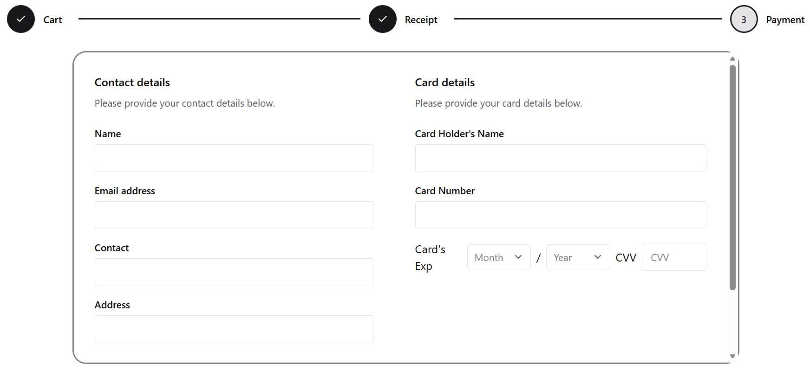
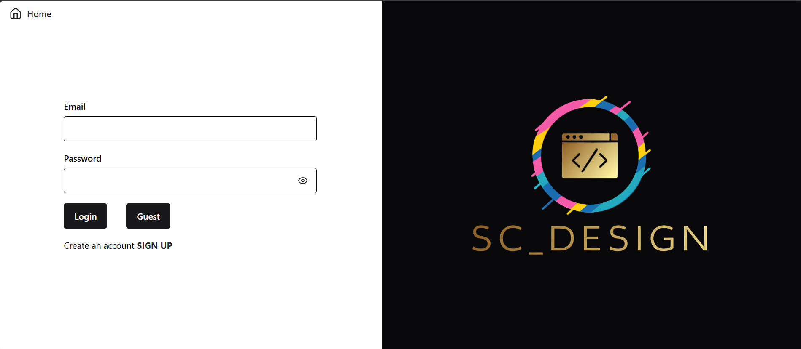
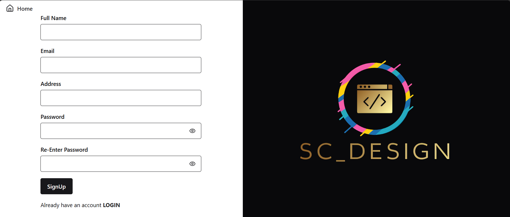

# PORTFOLIO PROJECT - E-COMMERCE WEB APPLICATION

A modern e-commerce web application built to streamline online shopping by providing users with an intuitive interface to browse, search, and view products.

## Preview


## About

This project is a modern e-commerce web application built to showcase my React.js development skills through a real-world application. It integrates a public REST API to simulate a complete online shopping experience, allowing users to browse products, view product details, and manage a shopping cart.

The project demonstrates modern frontend development practices, including component-based architecture, client-side routing, state management, session storage for cart persistence, and unit testing with Vitest. It was developed with a strong focus on writing clean, reusable, and maintainable code.

## Features

- ✅ Product Catalog
- ✅ Product Search
- ✅ Category Filtering
- ✅ Product Details
- ✅ Shopping Cart
- ✅ Quantity Management
- ✅ Checkout Process
- ✅ Checkout Progress
- ✅ Payment Selection
- ✅ Order Receipt
- ✅ Product Ratings
- ✅ Customer Reviews
- ✅ Stock Availability
- ✅ Responsive Design
- ✅ Loading States
- ✅ Error Handling

## Built With

### Frontend

- React
- React Router
- JavaScript
- HTML5
- CSS3
- Material UI
- Chakra UI
- Vitest

### APIs

- DummyJSON API

### Tools

- Git
- GitHub
- Vite
- VS Code

## Installation

Clone the repository:

```bash
git clone https://github.com/sc-forlife/E-commerce.git
```

Navigate to the project directory:

```bash
cd E-commerce
```

Install the dependencies:

```bash
npm install
```

Start the development server:

```bash
npm run dev
```

Open your browser and visit:

```
http://localhost:5173
```

## Screenshots

### Homepage



### View Product



### Cart



### Receipt



### Checkout



### Login



### Sign Up



## Challenges

- Building custom search and filtering logic for a selected subset of products, as the API's built-in search only supported the entire product collection.
- Writing and testing asynchronous API fetch functions with Vitest.
- Managing product quantity and price updates independently without affecting other products or components.
- Keeping the receipt synchronized with cart updates while managing shared state across sibling components.
- Designing a centralized state management solution using React Context to share data across the application.
- Keeping session storage synchronized with React state to ensure cart persistence across page refreshes.

## Future Improvements

- 🔐 User authentication with JWT
- 🔍 Advanced search and filtering (price, brand, ratings, category, etc.)
- 📱 Full responsive support for mobile devices
- 👤 User profile customization
- ❤️ Wishlist functionality
- 💬 User advised feedback

## Author

Salem Chirau

GitHub:

```
https://github.com/sc-forlife
```
